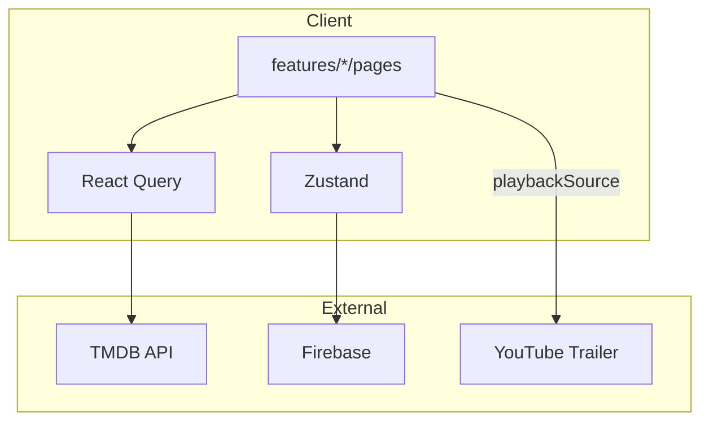

# MoviePlay

**가족 프로필 기반 영화 탐색 클라이언트** — 프론트엔드 엔지니어링 사례 (TMDB · Firebase · React Query)

[](https://github.com/stakim876/movieplay-react/actions/workflows/ci.yml)

**Live Demo** — _(Vercel 배포 후 URL 추가)_

---

## 이 프로젝트가 클론 코딩이 아닌 이유

가로 스크롤·히어로 배너는 OTT **업계 공통 UI 언어**입니다. 채용에서 평가하는 것은 픽셀 유사도가 아니라 아래입니다.

| 기업이 보는 것 | 이 레포 |
|----------------|---------|
| **문제 정의** | 가족 프로필 분리 · 키즈 이중 필터 · 추천 사유 · 예고편만 재생 |
| **범위 판단** | 본편·DRM 제외, `portfolioScope.ts`로 코드·문서화 |
| **상태 설계** | React Query(서버) + Zustand(세션) |
| **구조** | Feature-Sliced + queryKeys + feature barrel |
| **품질** | Vitest · Playwright · GitHub Actions |

👉 상세: [`docs/POSITIONING.md`](docs/POSITIONING.md) · [`docs/ENGINEERING.md`](docs/ENGINEERING.md)

---

## 한 줄 요약

저작권상 TMDB 메타데이터와 **공식 예고편**만 다루는 전제에서, **browse → detail → player** 제품 흐름과 프로필·추천·키즈 필터를 TypeScript로 설계한 **클라이언트 엔지니어링 포트폴리오**입니다.

---

## 채용 담당자용 3분 리뷰 가이드

| 순서 | 확인할 것 | 이 레포 |
|:---:|-----------|---------|
| 1 | Live URL이 열리는가 | ⚠️ 배포 후 README URL 업데이트 필요 |
| 2 | README만으로 범위·기술이 명확한가 | ✅ |
| 3 | 핵심 플로우가 끊기지 않는가 | 로그인 → 프로필 선택 → 홈 → 상세 → 재생(예고편) |
| 4 | 코드 구조가 읽히는가 | `app` / `core` / `features` / `shared` / `stores` |
| 5 | 품질 게이트가 있는가 | typecheck → Vitest(17) → build → Playwright |

**기대하지 않아도 되는 것** (의도적 제외): DRM, CDN, ML 추천 파이프라인, 본편 라이선스 스트리밍

상세 기술 판단: [`docs/ENGINEERING.md`](docs/ENGINEERING.md) · 설계: [`docs/ARCHITECTURE.md`](docs/ARCHITECTURE.md)

---

## 핵심 기능

| 영역 | 내용 |
|------|------|
| **Browse** | 홈 히어로, 카테고리, 검색, 상세, 인물, Top10 |
| **Playback** | YouTube 예고편 우선 · 없으면 샘플 영상 · 플레이어 UI |
| **Auth & Profile** | Firebase 인증 · 멀티 프로필 · 키즈 모드 |
| **Engagement** | 시청기록·찜·피드백 기반 클라이언트 추천 + 추천 사유 표시 |
| **Subscription** | 플랜 UI · 토스페이먼츠 위젯 (서버 승인 검증은 범위 밖) |

### 재생 범위 (저작권 · 포트폴리오)

| 콘텐츠 | 방식 |
|--------|------|
| 포스터·줄거리·출연 | TMDB API |
| 재생 | **공식 YouTube 예고편** 우선 |
| 예고편 없을 때 | 저작권-free 샘플 영상 (플레이어 UI 시연) |
| 제외 | 본편·DRM·CDN |

코드로 명시: [`src/shared/constants/portfolioScope.ts`](src/shared/constants/portfolioScope.ts) · 재생 결정: [`src/features/playback/lib/playbackSource.ts`](src/features/playback/lib/playbackSource.ts)

---

## 기술 스택

| 분류 | 선택 | 이유 |
|------|------|------|
| UI | React 18 + TypeScript (strict) | 타입 안전성, 업계 표준 |
| 빌드 | Vite 5 | 빠른 HMR, 라우트 단위 청크 |
| 라우팅 | React Router 6 | lazy route, protected route |
| 서버 상태 | TanStack React Query 5 | TMDB 캐시·로딩·에러 일원화 |
| 클라이언트 상태 | Zustand | auth, watchlist, theme — 경량 |
| 백엔드 | Firebase Auth + Firestore | 인증·프로필·찜·시청기록 |
| 데이터 | TMDB REST API | 메타데이터·예고편 키 |
| 테스트 | Vitest + Playwright | 단위 + E2E smoke |
| CI | GitHub Actions | PR마다 quality + e2e |

---

## 아키텍처

```
src/
├── app/              # App, 라우팅, QueryProvider, StoreBootstrap
├── core/             # TMDB, Firebase, ROUTES, queryKeys
├── features/
│   ├── browse/       # 홈·검색·상세·카테고리 (api/ hooks/ pages/)
│   ├── playback/     # 플레이어, playbackSource
│   ├── engagement/   # 추천 엔진 (순수 로직)
│   ├── auth/         # 로그인·회원가입·프로필 선택
│   ├── account/      # 프로필 설정
│   ├── watchlist/    # 찜
│   └── subscription/ # 구독·결제 UI
├── shared/           # 공통 UI, lib, constants
├── stores/           # Zustand
└── styles/           # tokens · buttons · themes
```



---

## 빠른 시작

### 요구 사항

- Node.js 20+
- npm 9+

### 설치

```bash
git clone https://github.com/stakim876/movieplay-react.git
cd movieplay-react
npm install
cp .env.example .env
# .env에 VITE_TMDB_API_KEY, VITE_FIREBASE_* 입력
npm run dev
```

→ http://localhost:5188

### 환경 변수

| 변수 | 필수 | 설명 |
|------|:---:|------|
| `VITE_TMDB_API_KEY` | ✅ | [TMDB API](https://www.themoviedb.org/settings/api) |
| `VITE_FIREBASE_*` | ✅ | Firebase 프로젝트 설정 |
| `VITE_TOSS_CLIENT_KEY` | | 구독 결제 UI (선택) |
| `E2E_TEST_EMAIL` / `PASSWORD` | | Playwright 인증 E2E (선택) |

---

## 스크립트

| 명령 | 설명 |
|------|------|
| `npm run dev` | 개발 서버 (5188) |
| `npm run typecheck` | TypeScript 검사 |
| `npm run test` | Vitest 단위 테스트 |
| `npm run test:e2e` | Playwright (build 후 preview) |
| `npm run build` | 프로덕션 빌드 |
| `npm run preview` | 빌드 결과 미리보기 |

---

## 테스트

**Unit (Vitest)** — 비즈니스 로직 위주

- `playbackSource.test.ts` — 예고편/샘플 분기
- `recommendation.test.ts` — 추천·키즈 필터
- `contentPath.test.ts` · `activeProfile.test.ts`

**E2E (Playwright)**

- `e2e/smoke.spec.ts` — 로그인·회원가입·비인증 리다이렉트
- `e2e/browse.spec.ts` — 로그인 → 상세 (테스트 계정 필요)

---

## 배포 (Vercel)

**상세 가이드:** [`docs/DEPLOY.md`](docs/DEPLOY.md)

1. [vercel.com](https://vercel.com) → GitHub Import
2. Environment Variables: `.env.example`의 `VITE_*` 항목 전부
3. Firebase **Authorized domains**에 `*.vercel.app` 추가
4. Deploy → README **Live Demo** URL 업데이트

> Live URL이 있으면 "클론이냐"보다 **"돌려봤네"** 판단이 먼저 납니다.

---

## 엔지니어링 하이라이트

- **Feature barrel** — `features/browse/index.ts` 등으로 public API 최소화
- **queryKeys 팩토리** — `core/api/queryKeys.ts` 중앙 관리
- **순수 재생 로직** — `resolvePlaybackSource()` 단위 테스트
- **디자인 토큰** — Cinema Noir 테마 + OTT 버튼 시스템
- **접근성** — skip link, 포커스 링, 시맨틱 레이아웃
- **CI** — merge 전 typecheck · test · build · e2e

실무 확장 시나리오는 [`docs/ENGINEERING.md`](docs/ENGINEERING.md) 참고.

---

## 문서

| 문서 | 내용 |
|------|------|
| [DEPLOY.md](docs/DEPLOY.md) | Vercel 배포 · env · Firebase 체크리스트 |
| [POSITIONING.md](docs/POSITIONING.md) | 클론 vs 채용 기준 · 소개 멘트 |
| [ARCHITECTURE.md](docs/ARCHITECTURE.md) | 레이어·데이터 흐름 |
| [ENGINEERING.md](docs/ENGINEERING.md) | 기술 판단·상태 관리·테스트·로드맵 |
| [CONTRIBUTING.md](CONTRIBUTING.md) | PR 체크리스트·코드 규칙 |

---

## 라이선스 & 저작권

- 이 저장소 코드: 포트폴리오 목적 (개인 프로젝트)
- 영화 메타데이터·이미지: [TMDB](https://www.themoviedb.org/) 이용 약관
- 예고편: YouTube 공식 임베드
- **본편 영상 스트리밍 없음** — 저작권 준수

---

**Seungtae Kim** · [GitHub](https://github.com/stakim876)
