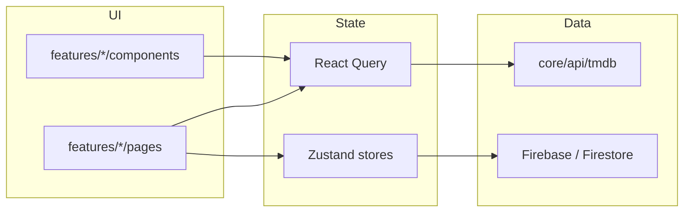

# MoviePlay Architecture

> 포트폴리오 OTT **클라이언트** — 본편 스트리밍 없이 TMDB + 예고편으로 제품 경험을 검증한다.

## 설계 원칙

| 원칙 | 적용 |
|------|------|
| **저작권 범위** | TMDB 메타데이터 + YouTube 공식 예고편만 재생. 본편·DRM·CDN 없음 |
| **Feature-Sliced** | 도메인별 `features/*` — browse, auth, playback, subscription 등 |
| **서버 vs 클라이언트 상태** | TMDB/Firestore → React Query / UI·세션 → Zustand |
| **공개 API** | feature `index.ts`로 외부 노출 surface 최소화 |

## 레이어 구조

```
src/
├── app/           # 진입점, 라우팅, 전역 Provider
├── core/          # 프레임워크 무관 인프라 (API, Firebase, ROUTES, queryKeys)
├── features/      # 제품 도메인 (페이지·컴포넌트·hooks·api)
├── shared/        # 도메인 무관 UI·hooks·lib·constants
└── stores/        # Zustand 클라이언트 상태
```

### `app/` — 애플리케이션 셸

- `App.tsx` — QueryProvider, StoreBootstrap, ErrorBoundary
- `routes/AppRoutes.tsx` — lazy route, PrivateRoute, Suspense
- `providers/` — React Query, 스토어 bootstrap

### `core/` — 공통 인프라

- `api/tmdb/` — TMDB REST
- `api/firestore/` — Firestore 데이터
- `api/queryKeys.ts` — React Query 키 팩토리
- `config/routes.ts` — URL 상수

### `features/` — 도메인

| Feature | 책임 |
|---------|------|
| `browse` | 홈, 검색, 상세, 카테고리, 인물 |
| `playback` | 플레이어, 재생 소스 결정 (`playbackSource`) |
| `auth` | 로그인, 회원가입, 프로필 선택 |
| `account` | 프로필 설정 |
| `watchlist` | 찜 |
| `subscription` | 구독·결제 UI |
| `engagement` | 추천 엔진 (`recommendation.ts`) |

각 feature 내부:

```
features/browse/
├── api/        # TMDB 호출·URL 빌드
├── hooks/      # React Query hooks
├── model/      # 도메인 타입
├── pages/      # 라우트 페이지
├── components/ # feature 전용 UI
└── index.ts    # public export
```

### `shared/` — 재사용

- `ui/` — MovieCard가 아닌 공통 컴포넌트 (Toast, Skeleton, ErrorBoundary)
- `lib/` — contentPath, trailer, activeProfile
- `constants/portfolioScope.ts` — 포트폴리오 범위 명시

## 데이터 흐름



### 재생 흐름 (포트폴리오 범위)

```
상세/재생 클릭
  → useMovieDetailQuery (React Query)
  → resolvePlaybackSource(detail)
       ├─ YouTube 예고편 있음 → iframe 재생
       └─ 없음 → 샘플 MP4 (플레이어 UI 시연)
  → PlaybackScopeNotice (범위 안내)
```

## 실제 Netflix/Disney+와의 차이 (의도적)

| Netflix | MoviePlay |
|---------|-----------|
| 자체 라이선스 본편 | TMDB 메타 + 예고편 |
| ML 추천 파이프라인 | 클라이언트 `engagement` 로직 |
| BFF + API 키 서버 | 클라이언트 TMDB (포트폴리오 규모) |
| 글로벌 CDN·DRM | 없음 |

## 신입 채용에서 이 구조로 보이는 것

1. **도메인 경계** — browse와 playback 분리
2. **상태 분리** — React Query vs Zustand
3. **테스트 가능성** — `playbackSource.test.ts`, recommendation tests
4. **제품 판단** — 키즈 필터, 추천 사유, 포트폴리오 범위 문서화
5. **운영 의식** — CI, E2E smoke, (권장) Live Demo

## 문서

| 문서 | 내용 |
|------|------|
| [ARCHITECTURE.md](./ARCHITECTURE.md) | 레이어·데이터 흐름 |
| [ENGINEERING.md](./ENGINEERING.md) | 기술 판단·테스트·로드맵 |

## 다음 단계 (실무)

- BFF로 TMDB 키 서버 이전
- Search/Personalized 전면 React Query
- GitHub Secrets로 인증 E2E CI
- Vercel Live Demo
